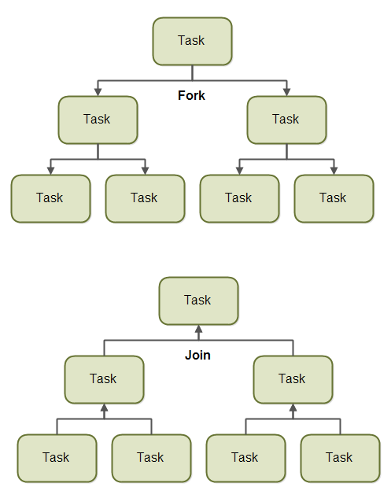
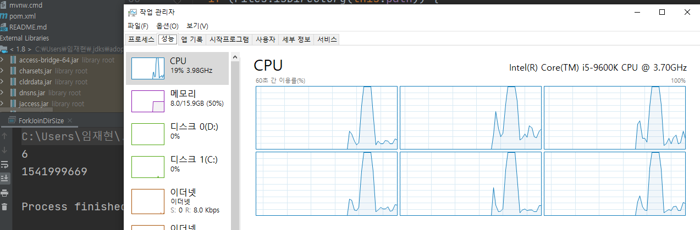

# Week 04 "Parallel Programming"

## 1. "분산", "병행", "병렬" 의 차이

* 분산 : 원격 서버 혹은 물리적인 장비에 작업을 분산시켜서 처리한다는 개념
* 병행, 병렬 - 이번 장에서는 그냥 합쳐서 "병렬" 이라는 용어로 통일
    * 공통점 : 하나의 물리적인 서버에서 동작한다는 공통점
    * 차이점
        1. 병행 : 하나의 CPU 코어에서 소프트웨어 적인 기법으로 동시에 여러 작업을 교차하면서 실행 (싱글 코어)
        2. 병렬 : 여러개의 코어에서 작업을 배분해서 동시에 작업을 실행하는 것 (멀티 코어)

## 2. 컨커런트 API

### 2.1. 특징

1. 데이터 동기화와 정합을 확보를 위해 Lock 객체를 제공
2. 대량 데이터 병렬 처리에 적합한 Executors 클래스 제공
3. 정합성 유지를 위한 컨터런트 컬렉션 클래스 제공
4. synchronized 키워드 사용을 최소화, 메모리 정합성 에러를 방지하는 기능 제공
5. 멀티 스레드 환경에서 효율적인 난수 생성 기능 제공

### 2.2. 컨커런트 API 패키지  [참고](https://www.uml-diagrams.org/java-7-concurrent-uml-class-diagram-example.html)

* 실행자 (Executors)
    * 작업을 실행하는 역할을 함
    * 구현체에 따라 "새로운 스레드 생성 / 기존 생성 스레드 재활용", "순차 / 병렬"
    * 스캐줄링 기능
* 큐 (Queues)
    * 멀티 스레드 환경에서 안정성을 보장
    * 사용하는 유형에 따라 다른 구현체를 제공
* 타이밍 (Timing)
    * 시간에 대한 정확성을 높이기 위해 사용
* 동기화 (Synchronizers)
    * Semaphore 클래스를 통해 쉽게 구현 가능
* 컨커런트 컬렉션
    * 컨커런트 API 환경에서 데이터를 다루기 위한 컬렉션 인터페이스 / 클래스

## 3. Executors 클래스

* 스레드 관리와 비즈니스 구현을 분리 가능
* Executors, ExecutorService, ScheduledExecutorService 인터페이스가 있음

### 3.1. Executors 인터페이스

* Thread 와 Runnable 인터페이스를 이용한 구현

```java
Thread myThread=new Thread(new Runnable(){
  @Override
  public void run(){
    System.out.println(Thread.currentThread());
  }
});

myThread.start();
```

* Executor 인터페이스를 이용한 구현

```java
Executor e=new Executor(){
  @Override
  public void execute(Runnable task){
    // 1. runnable 인터페이스를 직접 실행
    task.run();

    // 2. Thread를 생성해서 실행
    new Thread(task).start();
  }
};
e.execute(()->System.out.println(Thread.currentThread()));
```

### 3.2. ExecutorService 인터페이스

* 스레드 생성 / 관리 를 위한 메소드 추가

```java
// ExecutorService 객체 생성
final ExecutorService executorService = Executors.newSingleThreadExecutor();

// Thread 실행
executorService.execute(new MyTask("TODO 1"));
executorService.execute(new MyTask("TODO 2"));
executorService.execute(new MyTask("TODO 3"));

// ExecutorService 종료
executorService.shutdown();

/* ... */
public class MyTask implements Runnable {
  // ...
  TimeUnit.SECONDS.sleep(1);
  // ...
}
/* ... */
```
* ExecutorService : 많이 사용되는 핵심 인터페이스
* Executors : 구현체를 직접 제공
* TimeUnit : 시간 관련 클래스
* 실제 ExecutorService 구현 하기가 까다로움, 그래서 유틸성으로 Executors 제공
```java
Executors.newSingleThreadExecutor();
Executors.newFixedThreadPool(10);
Executors.newCachedThreadPool();
Executors.newWorkStealingPool();
Executors.unconfigurableExecutorService(Executors.newSingleThreadExecutor());
```
* newSingleThreadExecutor : 오직 하나의 스레드로 처리
* newFixedThreadPool : 생성할 스레드풀 크기 지정
* newCachedThreadPool : 멀티 스레드 / 기존 스레드 재사용
* newWorkStealingPool : 사용 가능한 모든 프로세스를 사용하도록 설정
* unconfigurableExecutorService : ExecutorService 가 가지는 인터페이스로 실행 제한시 사용
> 어떤 스레드 풀을 이용해서 병렬 처리할 것인가를 잘 생각해야함

### 3.3. ScheduledExecutorService 인터페이스
* Task 스캐줄링 기능 추가
* 주기적 실행, 예약 기능에 주로 사용
```java
Executors.newScheduledThreadPool(10);
Executors.newSingleThreadScheduledExecutor();
Executors.unconfigurableScheduledExecutorService(Executors.newSingleThreadScheduledExecutor());


/* ... */
final ScheduledExecutorService exeService = Executors
        .newSingleThreadScheduledExecutor();

// 설정한 TimeUnit 단위 마다 무한 반복
exeService.schedule(() -> System.out.println("TODO 1"), 5, TimeUnit.SECONDS);
exeService.schedule(() -> System.out.println("TODO 2"), 10, TimeUnit.SECONDS);
exeService.schedule(() -> System.out.println("TODO 3"), 15, TimeUnit.SECONDS);

exeService.shutdown();
/* ... */

// schedule(Runnable command, long delay, TimeUnit unit)
exeService.schedule(() -> System.out.println("test"), 5, TimeUnit.SECONDS);

// schedule(Callable<V> callable, long delay, TimeUnit unit)
final ScheduledFuture<Integer> schedule = 
        exeService.schedule(() -> {
          System.out.println("test");
          return 1;
        }, 5, TimeUnit.SECONDS);
System.out.println(schedule.get());

// scheduleWithFixedDelay(Runnable command, long initialDelay, long delay, TimeUnit unit)
exeService.scheduleWithFixedDelay(() -> System.out.println("test"), 5, 5, TimeUnit.SECONDS);

// scheduleAtFixedRate(Runnable command, long initialDelay, long period, TimeUnit unit)
exeService.scheduleAtFixedRate(() -> System.out.println("test"), 5, 10, TimeUnit.SECONDS);

```
* schedule(Runnable command, long delay, TimeUnit unit)
  * Runnable 클래스를 delay 시간만큼 후에 실행. 한번만 실행
* schedule(Callable<V> callable, long delay, TimeUnit unit)
  * Callable 클래스를 delay 시간만큼 후에 실행. 한번만 실행
* scheduleWithFixedDelay(Runnable command, long initialDelay, long delay, TimeUnit unit)
  * Runnable 클래스를 initialDelay 시간만큼 후에 실행. 이후 delay 시간만큼 대기 후 재실행 반복
* scheduleAtFixedRate(Runnable command, long initialDelay, long period, TimeUnit unit)
  * Runnable 클래스를 initialDelay 시간만큼 후에 실행. 이후 지정한 period 값 주기로 실행
  
### 3.4. TimeUnit
* Thread.sleep 는 밀리초 단위라 개발자가 계산해서 작업해야함
* TimeUnit 을 사용하면 속성을 통해 설정 가능
* 가독성 높음

## 4. 포크 / 조인 프레임워크
* ExecutorService 인터페이스를 구현한 클래스
* 주된 목적은 멀티 프로세서 혹은 멀티 코어를 가지고 있는 하드웨어 자원을 최대한 효율적으로 활용해서 병렬 처리가 가능하도록 하는것
* Fork : 다른 프로세스 혹은 스레드를 여러 개로 쪼개서 새롭게 생성한다는 의미
* Join : 포크해서 실행한 프로세스 혹은 스레드의 결과를 취합한다는 의미

* 스레드를 생성하는 "컨커런트 API" + 자원을 효율적으로 사용하는 "포크/조인 프레임워크" -> 컨커런트 API 를 극대화 할 수 있는 기능
* 하위 작업 분할 기준은 개발자가 정해야함
* 대표적 클래스
  * ForkJoinPool
    * 스레드 풀의 일종
    * 잡 훔치기 (Work-Stealing) 알고리즘을 사용
  * ForkJoinTask
    * ForkJoinPool 에서 실행 가능한 테스크들은 해당 클래스를 상속받은 클래스
    * RecursiveTask 의 상위 클래스
  * RecursiveTask
    * 실제 업무에 사용되는 구현체가 해당 클래스를 상속받아야함
    * compute 메소드를 구현받아야 함
  * RecursiveAction
    * RecursiveTask 와 비슷한 용도이나 리턴값이 없음
    * Join 동작이 필요가 없음
  
### 4.1. 실제 구현 방법
* RecursiveTask(RecursiveAction) 를 구현
* RecursiveTask 를 사용한다는 것은 compute 메소드를 구현한다는 뜻
* compute 의 의사 코드
```java
if( 하위 작업으로 분리할 수 있는지 판단) {
  하위 작업으로 분리;
  재귀 호출;
} else {
  테스크 실행;  
}
```
* 주어진 숫자 합을 구하는 [예제](../../src/main/java/com/bakeryblueprint/modernjava/week04/ForkJoinSumCalculator.java)
* 하위 디렉토리 파일 크기 합을 구하는 [예제](../../src/main/java/com/bakeryblueprint/modernjava/week04/ForkJoinDirSize.java)
* 눈여겨 봐야할 부분은 분기문을 통해 다시 서브 테스크로 나누는 부분이다.
* 실제 코어 수 만큼 병렬 처리가 진행된다.
* cpu 사용률이 100% 인것을 확인가능

  
* 처리해야 하는 I/O 작업이나 오래 걸리는 작업일수록 병렬 처리에 효율을 기대할 수 있다.
* 잘못된 사용은 하드웨어 자원을 많이 소모하면서 처리 속도도 느려지는 역효과가 날 수 있다.

### 4.2. 포크 조인 프레임워크를 제대로 사용하는 방법
* join 메서드를 태스크에 호출하면 태스크가 생산하는 결과가 준비될 때까지 호출자를 불록시킨다. 두 서브 태스크가 모두 시작된 다음에 join 을 호출해야한다.
* RecursiveTask 내에서는 ForkJoinPool 의 invoke 메서드를 사용하지 말아야 한다. 병렬 계산을 시작할 때만 invoke 를 호출
* 한쪽 작업에는 fork를 호출하는 것보다 compute를 호출하는 것이 더 효율적일 수 있다. 스레드를 재사용 할 수 있기 때문이다.
* 순차 처리보다 무조건 빠른것은 아니다. 측정을 통해 계산해야 한다.

### 4.3. 작업 훔치기
* 복잡한 시나리오에서는 각각의 서브태스크의 작업완료 시간이 크게 달라질 수 있다.
* 포크 / 조인 프레임워크에서는 작업 훔치기 라는 기법을 통해 이 문제를 해결한다.
* 각각의 스레드는 자신에게 할당된 태스크를 포함하는 이중 연결 리스트를 참조하고 있다.
* 작업이 끝난 스레드는 큐 (이중연결 리스트)의 헤드에서 다른 태스크를 가져와 작업을 처리한다.
* 할일이 없어진 쓰레드는 유휴 상태가 되는 것이 아니라 다른 스레드의 큐(이중연결 리스트)의 '꼬리'에서 작업을 훔쳐와 진행한다.

## 5. Future 와 CompletableFuture
### 5.1. Future 인터페이스
* Future 인터페이스는 비동기 연산의 결과를 표현한다.
* Future 가 제공하는 인터페이스   [예제](../../src/main/java/com/bakeryblueprint/modernjava/week04/FutureExample.java)
> V get() :  Callable 등 작업의 실행이 완료될 때 까지 블록킹 되며, 완료되면 그 결과값을 리턴한다.  
> V get(long timeout, TimeUnit unit) :  지정한 시간 동안 작업의 실행 결과를 기다린다. 지정한 시간 내에 수행이 완료되면 그 결과값을 리턴한다. 대기 시간이 초과되면 TimeoutException을 발생시킨다.  
> boolean cancel(boolean mayInterruptIfRunning) : 이 작업을 취소하려고 시도한다.  
> boolean isCancelled() : 작업이 정상적으로 완료되기 전에 취소가 된 경우에 true를 리턴한다.  
> boolean isDone() : 작업이 완료된 경우에 true를 리턴한다. 

* Future 인터페이스를 사용하면 저수준 스레드 프로그래밍을 하지 않아도 처리 상태를 확인 가능하고 결과를 쉽게 조회 가능하다.
> Callable 인터페이스는 멀티 스레드 기반으로 동작하기위한 인터페이스, Runnable과의 차이점은 리턴값이 있음

### 5.2. CompletableFuture 클래스
* CompletableFuture 클래스는 Future 인터페이스의 구체적인 구현체
* 다양한 비즈니스 로직을 구현하기 위해서는 Future 인터페이스의 완료여부를 판단하고 결과값을 받아오는 것만으로는 충부하지 않음
* 비동기 연산을 파이프라인으로 연결 가능하다.  [예제](../../src/main/java/com/bakeryblueprint/modernjava/week04/CompletableFutureExample.java)
* 많이 사용되는 메서드
  * runAsync : Runnable 인터페이스 구현체를 실행시킨다. 외부에 값을 리턴하지는 않는다.
  * supplyAsync : Supplier 인터페이스 구현체를 실행시킨다. 리턴 객체가 있어 결과를 확인할 수 있다.
  * 두 메서드는 결과를 확인할 수 있냐 없냐 차이다.
  * 두 메서드 모두 CompletableFuture 를 반환한다.
```java
final CompletableFuture<Void> voidFuture = CompletableFuture
        .runAsync(() -> System.out.println("Runnable1~"))
        .thenRun(() -> System.out.println("Runnable2~"));
final CompletableFuture<Integer> IntegerFuture = CompletableFuture
        .supplyAsync(() -> {
          System.out.println("Supplier~");
          return 1;
        })
        .thenApply(integer -> integer + integer);

          System.out.println(IntegerFuture.get());
```
* thenRun, thenApply 등을 통해 연결 작업을 만들 수 있다.
* 동기 작업을 비동기로 만드는 (호출하는 로직을 변경) [예제 P209~210](../../src/main/java/com/bakeryblueprint/modernjava/week04/InsuranceCalculator.java)
* 동기 작업을 비동기로 만드는 (내부 구조를 변경해서 비동기로 변경) [예제 P211](../../src/main/java/com/bakeryblueprint/modernjava/week04/InsuranceCalculator.java)

## 6. 스트림 병렬 처리
### 6.1. 스트림 병렬 처리 이해

* 스트림 API 에서는 parallelStream 메서드 이용만으로 손쉽게 병렬 처리 가능
* 순차 처리로 만들어진 스트림도 손쉽게 병렬처리 가능 [예제](../../src/main/java/com/bakeryblueprint/modernjava/week04/ChangeParallelExample.java)
* 실제로 만들어 지는 스레드는 어떤 스레드일까? [예제](../../src/main/java/com/bakeryblueprint/modernjava/week04/InsideParallelStream.java)
* 처리를 할때 순서가 중요하다면 병렬 처리를 해서는 안도니다.
* PC나 서버의 코어수에 따라 스레드가 생성 된다.
* main 스레드가 존재하고 main 스레드가 ForkJoinPool 스레드를 생성한다.
  * 스레드 생성은 ExecutorService 관리
  * ForkJoinPool은 ExecutorService 인터페이스를 구현한 클래스
  * 코어 수 기반의 스레드 생성은 스트림에서 제어하는 것이 아니라 ForkJoinPool 에 영향은 받는다.

### 6.2. 스레드 개수 제어

* PC 혹은 서버의 코어수 만큼 스레드가 생성이 되고 , 이것이 전체 CPU를 선점하는 현상이 일어남
* 다른 어플리케이션에 영향을 미치게 됨 -> 스레드 개수 제한이 꼭! 필요함
  * ForkJoinPool의 기본 스레드 값을 변경한다. [예제](../../src/main/java/com/bakeryblueprint/modernjava/week04/InsideParallelStream2.java)
    * 설정한 스레드 값(ForkJoinPool) + main 스레드 만큼의 스레드 수가 설정
    * 자바 가상 머신 전체에 영향을 미침, 가상머신 종료까지 유효한 수치 -> 주의!
  * ForkJoinPool 말고 다른 스레드 풀을 사용한다. [예제](../../src/main/java/com/bakeryblueprint/modernjava/week04/InsideParallelStream3.java)
    * 사용자가 만들어둔 Pool 안에서 동작이 수행
    * 여기서는 설정한 만큼만 스레드가 생성됨
  
### 6.3. parallel 과 sequential
* 순차 처리 <-> 병렬 처리를 중간에서 손쉽게 변경 가능
```java
list.stream().limit(100).parallel().reduce(Integer::sum);
```

## 7. 분할 반복 Spliterator
* Iterator 방식은 기본적으로 순차방식이기 때문에 병렬 처리를 위해서는 사용자가 직접 데이터를 분할하고 할당하는 작업이 필요함
* 8 에서는 편리하게 병렬 처리할 수 있도록 Spliterator 인터페이스를 제공
```java
public interface Spliterator<T> {
  boolean tryAdvance(Consumer<? super T> action);
  Spliterator<T> trySplit();
  long estimateSize();
  int characteristicscharacteristics();
}
```
* tryAdvance : 요소를 하나씩 순차적으로 소비하면서 탐색해야 할 요소가 남아있으면 참을 반환한다.(일반적인 iterator 동작과 동일)
* trySplit : Spliterator 일부 요소를 분할해서 두 번째 Spliterator 를 생성하는 메서드
* estimateSize : 탐색해야 할 요소 수 정보를 제공함
* [characteristics](https://docs.oracle.com/javase/8/docs/api/java/util/stream/Collector.Characteristics.html) : 특정 집합을 포함하는 int를 반환, 해당 내용을 통해 최적화와 제어 방법을 설정
  * ORDERED : 리스트처럼 요소해 정해진 순서가 있으므로 Spliterator를 분할할 때 이 순서에 유의해야 한다.
  * DISTINCT : x, y 두 요소를 방문했을 때 x.equals(y) 는 항상 false를 반환한다.
  * SORTED : 탐색된 요소는 미리 정의된 정렬 순서를 따른다.
  * SIZE : 크기가 알려진 소스(예를 들면 Set)로 Spliterator를 생성했으므로 estimateSize()는 정확한 값을 반환한다.
  * NONNULL 탐색하는 모든 요소는 null이 아니다.
  * IMMUTABLE : 이 Spliterator는 불변이다. 즉, 요소를 탐색하는 동안 요소를 추가하거나, 삭제하거나, 고칠 수 없다.
  * CONCURRENT : 동기화 없이 Spliterator의 소스를 여러 스레드에서 동시에 고칠 수 있다.
  * SUBSIZED : 이 Spliterator 그리고 분할되는 모든 Spliterator 는 SIZE 특성을 갖는다.
  * 예시
    ```java
    // Set 의  Spliterator 는 HashSet SIZED, DISTINCT 특성을 가짐
    public int characteristics() {
      return (fence < 0 || est == map.size ? Spliterator.SIZED : 0) |
          Spliterator.DISTINCT;
    }
    ```
    
* Spliterator 사용 예시
  * [Iterator 사용 예시](../../src/main/java/com/bakeryblueprint/modernjava/week04/IteratorExample.java)
  * [Spliterator 사용 예시](../../src/main/java/com/bakeryblueprint/modernjava/week04/SpliteratorExample.java)

* 순서가 중요한 작업에서는 사용 X
* Spliterator 역시 포크/조인 프레임워크와 결합해야 프로그래밍이 가능

## 8. 컨터런트 컬렉션
* Vector, HashTable 은 멀티 스레드 환경에서 사용할 수 있도록 synchronized 키워드를 남발
* 성능 저하로 연결
* 동기화 키워드를 제거한 List, HashMap 제공
* 병렬 프로그래밍을 위한 특화된 컬렉션을 제공

### 8.1. 컨터런트 컬렉션 
* BlockingQueue : 클라이언트로부터 요청 받은 데이터를 순차적으로 처리하기 위해 많이 사용
* ConcurrentMap : HashMap 에 대응
* ConcurrentNavigableMap : TreeMap에 대응

## 9 기타 기능
### 9.1. 원자적 변수
* 특정 변수가 병렬 처리에서 원자성을 가지기 어려움
* synchronized 를 사용 하는 방법이 있음
* 그러나 이런 기능 말고도 원자성을 유지하게 해주는 클래스가 있음
* boolean, int, long, int 배열, long 배열 등의 값이 원자성을 유지하도록 제공
* 객체용도 있음 (제네릭하게 설계)
* 누적 / 추가를 위한 클래스 제공
```java
public class AtomicExample {
    private AtomicBoolean locked = new AtomicBoolean(false);
    // get(), set(), getAndSet(), compareAndSet() 등을 제공
    public boolean lock() {
    	return locked.compareAndSet(false, true);
    }
}
```
### 9.2. 컨커런트 랜덤 숫자
* Random 클래스는 많이 사용하고 있지만 성능이 좋지 않음
* ThreadLocalRandom 클래스를 이용하면 더 좋은 성능 확보가 가능함