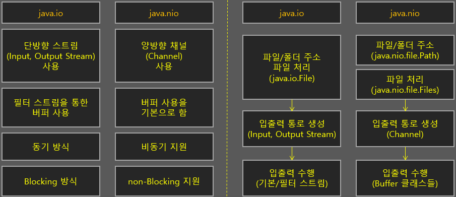

# Week 05 "File I/O (NIO 2.0) (1)"

## 1. I/O vs. NIO(New Input Output)
> 참고
> * [[Java 08] IO vs. NIO](https://blog.naver.com/whdgml1996/222021170762)
>* [[Java] IO / NIO 차이](https://blog.naver.com/jerry9722/222144959318)
* NIO: New Input Output
* java.nio 패키지



### 1.1. Stream vs. Buffer
* I/O - Stream 기반 동작
    * stream된 데이터는 cache되지 않기 때문에 정해진 순서대로 읽어야 함
    * 입력/출력 스트림이 구분되어 있음
* NIO - Buffer 기반 동작
    * 쓰거나 읽고 난 뒤에 buffer에 내용에 저장되면 이를 나중에 처리 가능 → buffer 내에서 데이터의 앞뒤 내용을 자유롭게 참조할 수 있음
    * I/O 시에 Channel 사용, 양방향 연결 가능

### 1.2. Blocking vs. Non-Blocking
* I/O - blocking 
    * IO가 완료되기 전까지 IO를 호출한 쓰레드는 blocked 상태가 됨
* NIO - non-blocking
    * IO가 일어나는 동안 다른 일을 할 수 있음 (Selector 때문에)
        * Selector: 복수 개의 채널 중에서 준비완료된 채널을 선택
        
## 2. NIO 개념 이해하기

### 2.1. 파일 NIO 특징 
* 심볼릭 링크 지원 (심볼릭 링크: 다른 파일/디렉토리를 참조하는 가상의 파일/디렉토리)
* 상호 운영성: java.io.File 클래스에 자바 8의 파일 NIO를 지원하기 위한 메서드 추가됨
    * toPath : 파일 NIO의 Path객체 리턴 → 파일 NIO 활용 가능
* 가시성
* 파일 동기화 기능: 데이터가 파일에 저장될 때 깨지거나 소실될 소지 없이 저장되는것 보장
* 예외 처리 명확화
    * 기존 IO에서는 모든 예외 상황에서 IOException 하나만 발생
    * java.nio.file 패키지에 총 19개의 Exception 클래스 제공

### 2.2. 주요 인터페이스와 클래스 
* Path 인터페이스
    * 경로 정보를 제공하는 인터페이스
    * 경로 정보를 기반으로 파일 객체를 생성
    * 파일 혹은 디렉토리의 절대 위치, 상대 위치 정보 등을 포함
* Files 클래스
    * 특정 경로 상에 위치한 파일이나 디렉토리에 대한 정보를 제공하는 클래스

### 2.3. I/O와 NIO 비교
* NIO는 경로 처리와 파일 처리가 별도로 분리되어 있음
```java
/**
 * 예) 파일 생성시
 */
// I/O
File file = new File("D:/data");
file.createNewFile();
// NIO
Path path = Paths.get("D;/data");
Files.createFile(path);
```
## 3. 경로의 특징
> 트리 구조로 관리 - 파일을 효율적으로 관리하면서 해당 파일에 쉽게 접근 가능
* 루트: 트리의 가장 처음 시작 지점 (예: /, C:\, D:\)
* 파일 구분자: 유닉스/리눅스 계열 - /, 윈도우 계열 - \
* 절대 경로/상대 경로
    * 절대 경로: 운영체제의 루트를 기준으로 자원이 있는 위치 의미
    * 상대 경로: 특정 자원의 위치 정보를 기준으로 다른 자원의 위치를 표시
* 링크: 상대 경로/절대 경로에 있는 자원의 위치 정보를 특정한 위치로 연결하여 사용 (유닉스/리눅스 계열 - 심볼릭 링크, 윈도우 계열 - 바로가기)

## 4. Path 를 이용한 경로 관리
* Java 7에서 경로 정보를 Path 인터페이스로 분리 
    * Java 6 까지는 File 클래스에 파일/디렉터리/경로에 대한 정보 포함
* Path는 플랫폼 독립적이지 않음
    * 운영 체제가 다르면 경로 정보는 호환되지 않음
* Path의 정보가 반드시 해당 위치에 파일/디렉토리가 있다는 것을 의미하지는 않음 (절대값/상댓값 등의 개념도 포함)
    * Path를 기반으로 물리적인 작업을 할 때에는 파일/디렉토리가 실제로 존재하는지 항상 확인해야 함

### 4.1. Path 객체 생성
```java
// 1. 문자열을 이용하여 객체 생성
Path path = Paths.get("/private/etc/hosts");
// 2. URI 클래스를 이용하여 객체 생성
Path p2 = Paths.get(URI.create("/private/etc/hosts"));
// 3. FileSystems 클래스를 이용하여 객체 생성
// 파일 시스템의 기본 객체를 얻어와, 주어진 문자열 경로 정보를 기반으로 Path 생성
Path p3 = FileSystems.getDefault().getPath("/private/etc/hosts");
```
* static 메서드 이용 (팩토리 메서드)
```java
public final class Paths {
    ...
    public static Path get(String first, String... more) {
        return Path.of(first, more);
    }
    public static Path get(URI uri) {
        return Path.of(uri);
    }
}
```
* Paths클래스: Path 처리를 위한 유틸리티 메서드들을 모아 놓은 클래스 

### 4.2. Path 정보 활용
#### 1) 절대값 기준 Path 객체 정보 조회 
* Path 객체의 디렉토리 정보는 구분자를 기준으로 분해한 정보를 Path 내에서 관리
* getName 메서드(int index): 입력한 인덱스 값에 해당하는 각 단계별 경로명을 순서대로 리턴함
```java
import java.nio.file.Path;
import java.nio.file.Paths;

public class PathInformation {
	public static void main(String[] args) {
		// 문자열을 이용하여 객체 생성
		Path path = Paths.get("/private/etc/hosts");

		System.out.format("toString: %s%n", path.toString());
		System.out.format("getFileName: %s%n", path.getFileName());
		System.out.format("getNameCount: %d%n", path.getNameCount());
		System.out.format("getName(0): %s%n", path.getName(0));
		System.out.format("getName(2): %s%n", path.getName(2));
		System.out.format("subpath(0,2): %s%n", path.subpath(0,2));
		System.out.format("getParent: %s%n", path.getParent());
		System.out.format("getRoot: %s%n", path.getRoot());
	}
}
##### 실행 결과 #####
toString: /private/etc/hosts
getFileName: hosts
getNameCount: 3
getName(0): private
getName(2): hosts
subpath(0,2): private/etc
getParent: /private/etc
getRoot: /
```

#### 2) 상대값 기준 Path 경로 정보 조회
* getRoot() 는 null 을 리턴, 절대 경로가 아니어서 루트에 대한 정보가 없음 
* getRoot가 null인지 확인하여 절대 경로인지 상대 경로인지 확인
```java
import java.nio.file.Path;
import java.nio.file.Paths;

public class RelativePath {
	public static void main(String[] args) {
		Path path = Paths.get("./RelativePath.txt");

		System.out.format("toString: %s%n", path.toString());
		System.out.format("getFileName: %s%n", path.getFileName());
		System.out.format("getName(0): %s%n", path.getName(0));
		System.out.format("getNameCount: %d%n", path.getNameCount());
		System.out.format("subpath(0,2): %s%n", path.subpath(0,2));
		System.out.format("getParent: %s%n", path.getParent());
		System.out.format("getRoot: %s%n", path.getRoot());	// null 리턴
	}
}
##### 실행 결과 #####
toString: ./RelativePath.txt
getFileName: RelativePath.txt
getName(0): .
getNameCount: 2
subpath(0,2): ./RelativePath.txt
getParent: .
getRoot: null
```

#### 3) 절대 경로로 전환
* 데이터 저장이나 위치 정보를 로그에 찍을 때
* toAbsolutePath(): 상대 경로 앞에 현재 상대 경로의 기준이 되는 경로를 추가
* normalize(): .나 ..와 같은 특수경로(redundancy)를 일반화
```java
// toAbsolute()
// 예) toString: /Users/ssookie/Documents/ssookie/andy-java/./RelativePath.txt
Path fullPath = inputPath.toAbsolutePath();

// normalize()
// 예) toString: /Users/ssookie/Documents/ssookie/andy-java/RelativePath.txt
Path normalizePath = path.toAbsolutePath().normalize();
```
* toRealPath()
    * Path 객체가 담고 있는 경로 정보의 실제 경로를 리턴 
        * Path 정보가 상대 경로라면 절대 경로로 변환해서 리턴
        * Path 정보가 특수 경로(리던던시)를 포함하고 있으면 일반화하여 리턴
    * 파일 시스템상에 실제로 존재하지 않으면 NoSuchFileExeption을 발생시킴 (실제 I/O 연산 발생)
    * LinkOption.NOFOLLOW_LINKS
        * 심볼릭 링크에 대한 처리를 생략하고 나머지 작업 수행
        * 예) 상대 경로를 절대 경로로 변환 / 디렉터리 문자열의 특수 기호 제거 / 실제로 존재하는 여부 확인 
```java
public class ToRealPath {
	public static void main(String[] args) {
		try {
			// 심볼릭 링크 생성
			// ch07_symbolic -> /Users/ssookie/Documents/ssookie/PracticalModernJava/insight-newjava/src/insightbook/newjava/ch07

			// 심볼릭 링크를 실제 경로로 전환해서 객체 생성
			// toString: /Users/ssookie/Documents/ssookie/PracticalModernJava/insight-newjava/src/insightbook/newjava/ch07
			Path path = Paths.get("/Users/ssookie/Downloads/ch07_symbolic").toRealPath();
			print(path);

			// 심볼릭 링크 경로로 객체 생성
			// toString: /Users/ssookie/Downloads/ch07_symbolic
			path = Paths.get("/Users/ssookie/Downloads/ch07_symbolic").toRealPath(LinkOption.NOFOLLOW_LINKS);
			print(path);
			
		}
		catch(IOException e) {
			e.printStackTrace();
		}
	}
...
}
```

#### 4) 두개의 경로 합치기
* resolve(): cd 명령어
```java
import java.nio.file.Path;
import java.nio.file.Paths;

public class JoinPath {
	public static void main(String[] args) {
		// 기존 경로를 구한다.
		// /Users/ssookie/Documents/ssookie/PracticalModernJava/insight-newjava/src/insightbook/newjava/ch07
		Path path = Paths.get("/Users/ssookie/Documents/ssookie/PracticalModernJava/insight-newjava/src/insightbook/newjava/ch07");
		System.out.println(path);
		
		// drivers 경로를 추가한다.
		// /Users/ssookie/Documents/ssookie/PracticalModernJava/insight-newjava/src/insightbook/newjava/ch07/drivers
		Path resolvedPath = path.resolve("drivers");
		System.out.println(resolvedPath);

		// 앞의 경로를 제거한다.
		// /Users/ssookie/Documents/ssookie/PracticalModernJava/insight-newjava
        // 전달된 값이 절대 경로이기 때문에 
		Path anotherPath = resolvedPath.resolve("/Users/ssookie/Documents/ssookie/PracticalModernJava/insight-newjava");
		System.out.println(anotherPath);
	}
}
```

## 5. 파일 관리 - 파일 정보를 생성하고 활용하기

### 5.1. Files 클래스
* 파일들, 디렉터리들 그리고 다른 종류의 파일들을 처리하기 위한 독점적인 static 메서드를 제공하는 클래스
* JDK에서 제공하는 유일하고 독점적(exclusive)인 역할
>유틸리티성 클래스의 특징
>* 별도의 생성자가 없음 → new를 이용하여 생성하지 않음
>* 모든 메서드는 static이며 그 외에는 모두 내부적으로 감추어져 있음

### 5.2. 파일과 디렉터리 검증
* 파일 존재 여부 확인
    * File.exists: 해당 자원이 존재하는지 확인, 존재시 true 리턴
    * File.nonExists: 해당 자원이 존재하지 않는지 확인, 존재시 false 리턴
* 파일인지 디렉터리인지 확인
    * Files.isDirectory: 디렉터리이면 true, 아니면 false 리턴(false이면 파일로 추정)
* 접근 권한 확인
    * 읽기 여부: Files.isReadable
    * 쓰기 여부: Files.isWritable
    * 실행 여부: Files.isExecutable
* 일반 파일인지 확인 
    * isRegularFile
    * 일반 파일: 특별한 속성이 없는 파일 (심볼릭 링크, 디렉터리 등...이 아닌 텍스트/바이너리 파일)

### 5.3. 파일과 디렉터리 복사
* java.io.File 클래스는 파일 복사 기능 제공하지 않음
    * 대안 01) FileInputStream/FileOutputStream 이용
    * 대안 02) FileReader/FileWriter 이용 [참고](../../src/main/java/com/bakeryblueprint/modernjava/week05/OldFileCopy.java)
    * 대안 03) NIO 의 FileChannel 클래스 이용 
    * 대안 04) 아파치 커먼 유틸리티의 FileUtils 이용
* NIO는 java.nio.file.Files 클래스에 파일 복사 기능 제공
    * Files.copy 메서드
    * StandardCopyOption
        * ATOMIC_MOVE: 파일을 다른 곳으로 이동할 때 정합성 보장을 위해 사용, 복사시에는 사용 불가
        * COPY_ATTRIBUTES: 파일의 속성까지 함꼐 복사
        * REPLACE_EXISTING: 대상 파일이 존재하면 덮어씀
```java
Files.copy(source, target, options);
...
CopyOption[] options = {StandardCopyOption.REPLACE_EXISTING};
```

### 5.4. 파일과 디렉터리 이동
```java
Files.move(source, target, options);
```
* 파일 이동 뿐 아니라 이름 변경시에도 사용
* 심볼릭 링크 이동 가능 (단, 대상에 동일한 이름의 링크가 존재해서는 안됨)
* 비어있지 않은 디렉터리를 이동하려고 하면 IOException발생 
    * 빈 디렉터리라면 정상적으로 이동
    * 비어 있지 않은 디렉터리 이동은 Files의 walkFileTree 메서드 이용하여 파일 복사/삭제 로직을 직접 해야 함
* 비어 있지 않은 디렉터리라도 이름 변경은 가능
>* Files.move 메서드는 파일을 옮기는 데만 사용하자. 

### 5.5. 파일과 디렉터리 이동
* delete: 파일, 디렉터리, 심볼릭 링크 삭제 가능
    * 심볼릭 링크 - 링크만 삭제되고 실제 대상 파일이 삭제되지는 않음
    * 디렉터리 - 비어있어야만 삭제됨, 비어있지 않으면 DirectoryNotEmptyException 발생
    * 삭제하려는 파일이 다른 프로그램에서 사용하거나 락 걸려있으면 IO Exception 발생
* deleteIfExists: 존재하지 않는 파일을 삭제하더라도 예외 발생하지 않음
```java
public class DeleteFileAndDirectory {
	public static void main(String[] args) {
		if(args.length < 1) {
			System.out.println("Usage : java DeleteFileAndDirectory <path>");
			return;
		}
		
		Path path = Paths.get(args[0]);
		
		try {
			Files.delete(path);
		} 
		catch (NoSuchFileException e) {
			System.err.format("%s : 파일 혹은 디렉토리가 없습니다. %n", path);
			e.printStackTrace();
		} 
		catch (DirectoryNotEmptyException e) {
			System.err.format("%s : 디렉토리가 비어 있지 않습니다.%n", path);
			
			try {
				// 심볼릭 링크가 아닐 경우만 삭제
				if(!Files.isSymbolicLink(path)) {
					deleteNotEmptyDirectory(path);
				}
			}
			catch(IOException e1) {
				System.err.println(e1);
			}
		} 
		catch (IOException x) {
			System.err.println(x);
		}
		
	}

	// 디렉토리에 포함되어 있는 모든 파일을 삭제한다.
	// 하위에 디렉토리가 포함되어 있을 경우 재귀호출한다.
	public static void deleteNotEmptyDirectory(Path path) throws IOException {
        if (Files.isDirectory(path, LinkOption.NOFOLLOW_LINKS)) {
        	try (DirectoryStream<Path> entries = Files.newDirectoryStream(path)) {
                for (Path entry : entries) {
                    deleteNotEmptyDirectory(entry);
                }
            }
        }
        Files.delete(path);
    }
}
```

### 5.6. 파일 속성 정보 확인 - 파일의 메타 정보 한번에 조회 [참고](../../src/main/java/com/bakeryblueprint/modernjava/week05/FileMetadata.java)
```java
// 기본 파일 속성
BasicFileAttributes attr = Files.readAttributes(file, BasicFileAttributes.class);

// Files.readAttribute 메서드
public static <A extends BasicFileAttributes> A readAttributes(Path path,
                                                               Class<A> type,
                                                               LinkOption... options)
    throws IOException
```
* 파일 속성 정보를 가지고 올 때, 원하는 형태의 클래스 객체에 담아서 가져올 수 있음
* BasicAttributes Interface: 파일 생성/수정과 같은 가장 기본이 되는 파일 속성 정보 가지고 있음
    * DosFileAttributes - 마이크로 소프트 
    * PosixFileAttributes - 유닉스/리눅스
